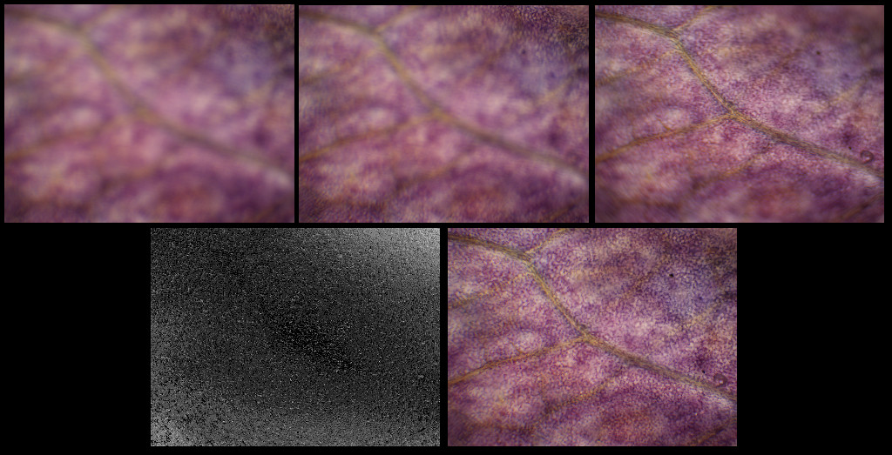

# Focus Stack

This program generates focus stacked images and depth maps given a
set of images taken at different focal depths. Additionally, it creates a depth map
that can be used to turn the image 3D.

This is commonly done in microscopy to generate images of a full specimen.

Example, top row is the input and the bottom is the stacked iamge and depth.



Stacked together using [Depthy](https://github.com/panrafal/depthy) it looks like this:

https://github.com/josephlewis42/focus-stack/assets/696193/fdf8a2f9-e797-4d44-9a52-ab3e9f7b5476

## Installing

Install using `go install`:

```.sh
go install github.com/josephlewis42/focus-stack
```

Or, download the repsitory and use `make`, the binary will be in `./bin/stack`:

```.sh
make build
```

## Running

```
focus-stack img1.png img2.png img3.png
```

Arguments should be a list of PNG or JPG images starting from the image farthest back.

Flags:

*  `-d string` Output file for depth map. (default `depth.png`)
*  `-o string` Output file for stacked image. (default `stacked.png`)

Example:

```sh
focus-stack \
   -d example/leaves/depth.png \
   -o example/leaves/stacked.png \
   example/leaves/*sm.png
```

### Limitations

* Images must be of the same size and JPG or PNG encoded.
* Images should be taken from a fixed camera position.
* The algorithm may not work on extremely large images.

## Technique

Images are read in, converted to grayscale, then have a Laplacian of Gaussian filter applied
to determine sharpness of each pixel.

## Contributing

Contributions are welcome! Some ideas:

* Adding the ability to [embed depth metadata](https://developers.google.com/depthmap-metadata/reference)
  in the output image.
* Adding a built-in viewer.
* Improving performance for very large images -- use the `--cpuprofile` flag to capture before/after snapshots.
* Adding tuning to the kernel parameters.

## License

Licensed under the [MIT License](/LICENSE).
